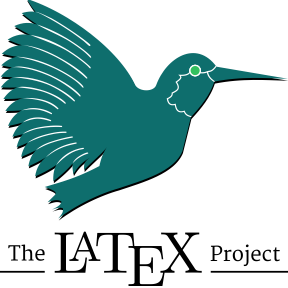
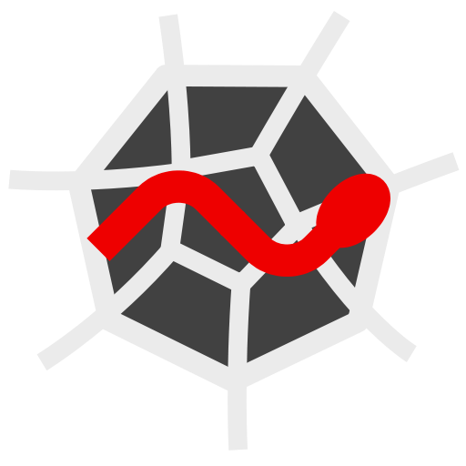

<!--
**Marlon-Gomes/Marlon-Gomes** is a ✨ _special_ ✨ repository because its
`README.md` (this file) appears on your GitHub profile.

Here are some ideas to get you started:

- 🔭 I’m currently working on ...
- 🌱 I’m currently learning ...
- 👯 I’m looking to collaborate on ...
- 🤔 I’m looking for help with ...
- 💬 Ask me about ...
- 📫 How to reach me: ...
- 😄 Pronouns: ...
- ⚡ Fun fact: ...
-->

# Hi there, I'm Marlon :wave:

## About me

I am an Investment Analyst working in the NY metro area. My background is in
Mathematics (I received my Ph.D. from Stony Brook University in 2020),
specifically Differential Geometry. My work employs methods of Statistics,
Information Geometry, and Machine Learning to the study of financial time
series, primarily using Python and the Wolfram Language/Mathematica. I enjoy
coding as a hobby.

- :books: I’m currently learning about
  - C++
  - Lua
  - Cryptography
  - Game development
- :handshake: I’m looking to collaborate on open source projects

## :capital_abcd: Languages

I'm familiar with the following languages, to various degrees of proficiency.

## :gear: Libraries and Frameworks

I employ the following Libraries and Frameworks often.

### Numerics, Data Analysis, and Statistics

    
    
    
    

### Visualization

    
    

### Machine Learning

### Web Development

    

## :hammer_and_wrench: Tools

I use the following suite of tools

### Editors and IDEs

### Version Control

### Notebook Environments

### :trophy: My Github Stats

<!-- TODO: FIX THIS

    
    

-->
## 📫 How to reach me

